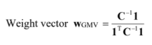

# SingAlliance Coding Task

To create an optimal portfolio using free historical data from the FTX Markets RESTful API.

## Usage
```
python3 main.py
```

## Explanation of steps
Here are the steps I took to attain the final resulting vector:

####Graphical method:
1. `HTTP GET` Request to obtain historical price data for designated tickers.
2. Start by obtaining the Covariance matrix, Mean vector and Volatility vector.
3. Applied the following formulas:
   1. `Portfolio_return = mean_vector * weight_vector`
   2. `Portfolio_risk = sqrt(transposed_weight_vector * covariance_matrix * weight_vector)`
4. Did N number of simulations using different randomized weight vectors from numpy.
5. Plot the Mean Variance Frontier graph and obtained global minimum variance portfolio.
6. Wrote to output file `Result.txt` 

####Analytical method:
1. Same as above
2. Same as above
3. Applied the following formula:


   

## License
[MIT](https://choosealicense.com/licenses/mit/)